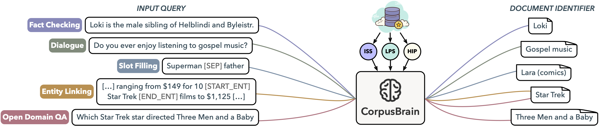

# CorpusBrain

This is the source code for paper "[CorpusBrain: Pre-train a Generative Retrieval Model for Knowledge-Intensive Language Tasks](https://arxiv.org/abs/2208.07652)".

## Introduction



**CorpusBrain** is a pre-trained generative retrieval model, which could encode all information about the corpus in its parameters without the need of constructing additional index.
Furthermore, **CorpusBrain** can dramatically simplify the search process and be optimized in an end-to-end manner by replacing the traditional multi-step search pipeline with a novel single-step generative model.
We show that a strong generative retrieval model can be learned with a set of adequately designed pre-training tasks, and be adopted to improve a variety of downstream retrieval tasks with further fine-tuning.

## Requirements and Installation

- Python version >= 3.7
- [PyTorch](http://pytorch.org/) version >= 1.6.0
- [fairseq](https://github.com/facebookresearch/fairseq) version >= 0.10

## Pre-training Corpus

### Download Data
The KILT knowledge source can be downloaded here: [kilt_knowledgesource.json](http://dl.fbaipublicfiles.com/KILT/kilt_knowledgesource.json) (34.76GiB).
It is based on the [2019/08/01 Wikipedia dump](http://dl.fbaipublicfiles.com/BLINK/enwiki-pages-articles.xml.bz2).

The BPE prefix tree (trie) from KILT Wikipedia titles that is based on the 2019/08/01 Wikipedia dump can be downloaded here: [kilt_titles_trie_dict.pkl](http://dl.fbaipublicfiles.com/GENRE/kilt_titles_trie_dict.pkl). The trie contains ~5M titles and it is used to generate document identifiers for all the KILT experiments.

The BART-Large checkpoint can be downloaded here: [bart.large.tar.gz](http://dl.fbaipublicfiles.com/fairseq/models/bart.large.tar.gz)

### Pre-process Data
To construct the pre-training data, run the following command:

```bash
bash scripts/preprocess_corpus.sh
```

## Pre-training
### Tokenize and Binarize Data
To tokenize and binarize the data as expected from `fairseq` use:

```bash
bash scripts/preprocess_fairseq.sh $DATASET_PATH $MODEL_PATH
```

### Pre-train Model
To pre-train the model, run the following command:

```bash
bash scripts/train.sh $DATASET_PATH $NAME
```

## Fine-tuning
CorpusBrain have the same architecture with `BART-Large`, and thus you can fine-tune CorpusBrain like BART on any downstream retrieval tasks by just replacing BART checkpoints with CorpusBrain's.

### Download KILT Data

CorpusBrain can be fine-tuned to serve a variety of downstream retrieval tasks in KILT. To download KILT data, run the following command:

```bash
mkdir data
python scripts/download_all_kilt_data.py
python scripts/get_triviaqa_input.py
```

### Convert KILT Data to Fairseq Format

To convert KILT data to fairseq format, run the following command:

```bash
python scripts/convert_kilt_to_fairseq_genre.py $input_filename $output_path
```

### Tokenize, Binarize and Fine-tune
These steps are the same as the pre-training steps above.


## Inference
After importing and loading the model and a prefix tree (trie), you would generate predictions with a simple call like:

```python
import pickle

from genre.fairseq_model import GENRE
from genre.trie import Trie

# Load the prefix tree (trie)
with open("../data/kilt_titles_trie_dict.pkl", "rb") as f:
    trie = Trie.load_from_dict(pickle.load(f))

# Load the model
model = GENRE.from_pretrained("models/corpus_brain").eval()

# Generate Wikipedia titles
model.sample(
    sentences=["Einstein was a German physicist."],
    prefix_allowed_tokens_fn=lambda batch_id, sent: trie.get(sent.tolist()),
)
```

```bash
[[{'text': 'Albert Einstein', 'score': tensor(-0.0708)},
  {'text': 'Werner Bruschke', 'score': tensor(-1.5357)},
  {'text': 'Werner von Habsburg', 'score': tensor(-1.8696)},
  {'text': 'Werner von Moltke', 'score': tensor(-2.2318)},
  {'text': 'Werner von Eichstedt', 'score': tensor(-3.0177)}]]
```

## Acknowledgement

- [fairseq](https://github.com/facebookresearch/fairseq)
- [GENRE](https://github.com/facebookresearch/GENRE)
- [KILT](https://github.com/facebookresearch/KILT)

## License

This project is under Apache License 2.0.

## Citation

If you find our work useful, please consider citing our paper:
```
@article{chen2022corpusbrain,
  title={CorpusBrain: Pre-train a Generative Retrieval Model for Knowledge-Intensive Language Tasks},
  author={Chen, Jiangui and Zhang, Ruqing and Guo, Jiafeng and Liu, Yiqun and Fan, Yixing and Cheng, Xueqi},
  journal={arXiv preprint arXiv:2208.07652},
  year={2022}
}
```
